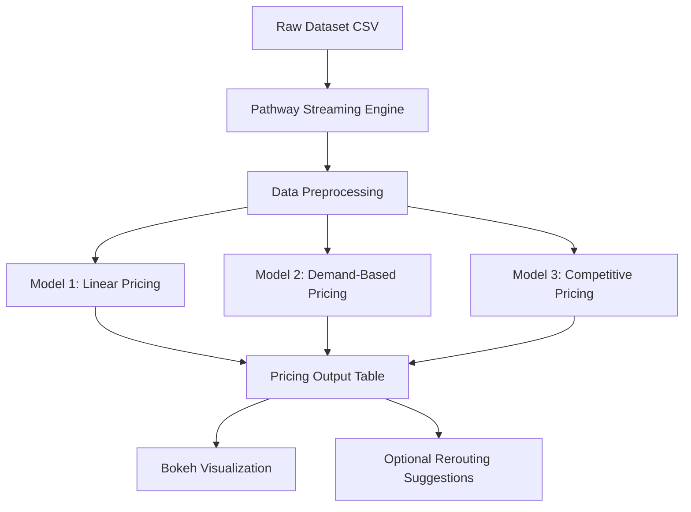

# urban-parking-dynamic-pricing

# Summer Analytics 2025

A real-time dynamic pricing engine built for urban parking lots using **Numpy**, **Pandas**, and **Pathway**, aimed at optimizing space utilization by adjusting prices based on demand, traffic, and queue metrics.

---

##  Overview

In modern cities, parking demand varies by time, traffic, and surrounding activity. Static pricing leads to inefficiencies like overcrowding or underuse. This project simulates **dynamic pricing strategies** for 14 parking spaces over 73 days and 18 time slots/day using machine learning-inspired logic built from scratch.

Key objectives:
- Dynamically price each parking space starting from a $10 base
- Ensure smooth, explainable variation using real-time signals
- Optionally reroute vehicles when nearby lots are cheaper or free

---

##  Tech Stack

| Tool / Library    | Purpose                            |
|-------------------|------------------------------------|
| Python (Colab)    | Development environment            |
| Pandas & Numpy    | Data handling & calculations       |
| Pathway           | Real-time streaming simulation     |
| Matplotlib        | Static data visualization          |
| Bokeh             | Interactive real-time visualization|
| Mermaid.js        | Architecture diagram               |
| GitHub            | Version control and sharing        |

---

##  Architecture Diagram (Mermaid)

Architecture & Workflow
This project follows a modular, real-time simulation pipeline for intelligent parking price adjustments.

1. Data Source
CSV containing 73 days of data from 14 parking lots, sampled every 30 minutes.

Features include: occupancy, capacity, queue_length, traffic_level, vehicle_type, is_special_day, latitude, longitude.

2. Pathway Streaming Engine
Simulates real-time ingestion of data row-by-row.

Maintains timestamp order to reflect actual event timing.

3. Data Preprocessing
Cleans and transforms data before modeling.

Tasks include:

Timestamp parsing

Normalizing vehicle_type

Computing geographic distances (for Model 3)

4. Pricing Models
Model 1 (Baseline Linear):

Price increases linearly with occupancy ratio.

Model 2 (Demand-Based):

Considers occupancy, queue length, traffic, special day, and vehicle weight.

Model 3 (Competitive Pricing) (optional):

Adjusts pricing based on competitor lot prices and proximity.

5. Output Generation
All predictions logged in a dynamic table (timestamp, lot_id, price, etc.).

Acts as source for downstream visualizations.

6. Real-Time Visualization
Built using Bokeh for interactive dashboards.

Price over time

Occupancy correlation

Nearby lot comparisons

7. Optional: Rerouting Logic
Suggests alternative lots when:

Current lot is full

Nearby lots are cheaper or underutilized

